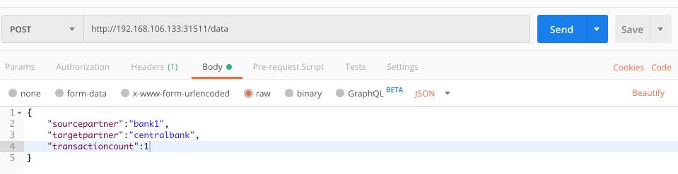

# Deploy Dockerized Node.js Application To Minikube

This document is a continuation of [this guide](https://github.com/cambazm/DockerizeNodeJsApp)

## 6. Execute below command, it will run your docker image you had built
`kubectl run itx-mysql-restapi --image=itx-mysql-restapi:v2 --port=3000 --image-pull-policy=Never`

## 7. Execute below command, it will expose your docker deployment you had deployed on minikube
`kubectl expose deployment itx-mysql-restapi --type=NodePort --port=3000 --target-port=3000`

## 8. Execute below command to get more information about the exposed service deployed
`kubectl describe service itx-mysql-restapi`
<br /><br />
<b>Sample output:</b>

```
Name:                     itx-mysql-restapi
Namespace:                default
Labels:                   run=itx-mysql-restapi
Annotations:              <none>
Selector:                 run=itx-mysql-restapi
Type:                     NodePort
IP:                       10.99.214.15
Port:                     <unset>  3000/TCP
TargetPort:               3000/TCP
NodePort:                 <unset>  31511/TCP
Endpoints:                172.17.0.9:3000
Session Affinity:         None
External Traffic Policy:  Cluster
9. My minikube IP was 192.168.106.133
http://192.168.106.133:31511/report   shows the report (http get)
http://192.168.106.133:31511/data      lists all data (http get)
```
<br />
<i>Check out the NodePort information</i> <br />

> POST to http://192.168.106.133:31511/data sample json below to insert data to database

```
{
	"sourcepartner":"bank1",
	"targetpartner":"centralbank",
	"transactioncount":1
}
```

## 10. You can test POST command via [Postman application](https://www.getpostman.com/), copy paste the json sample above, set html body to <i>raw</i>, and set Content-Type to <i>application/json</i>

